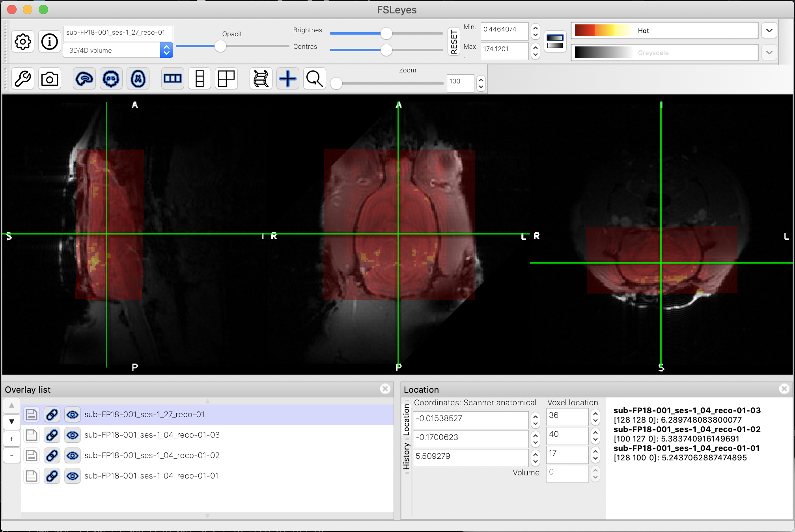
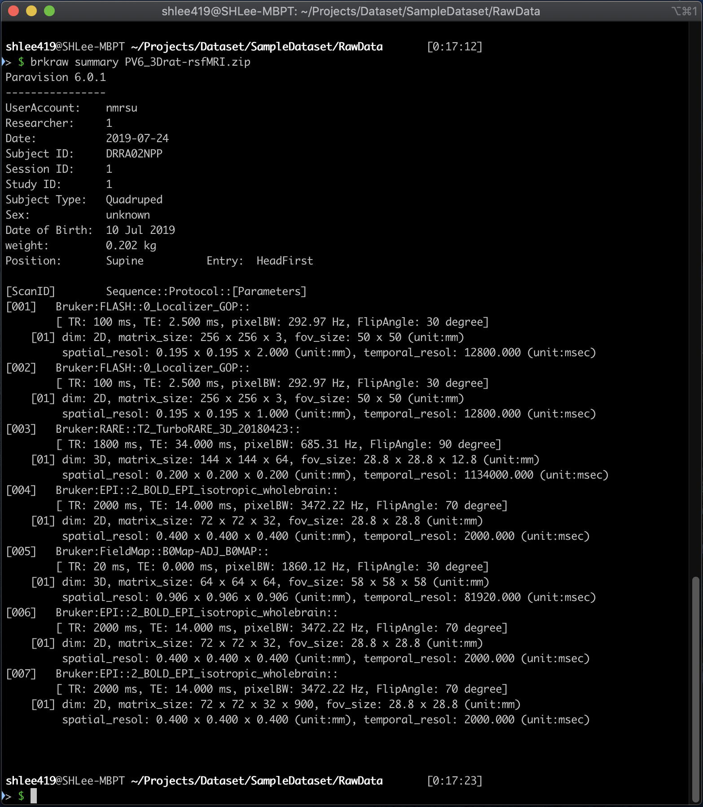
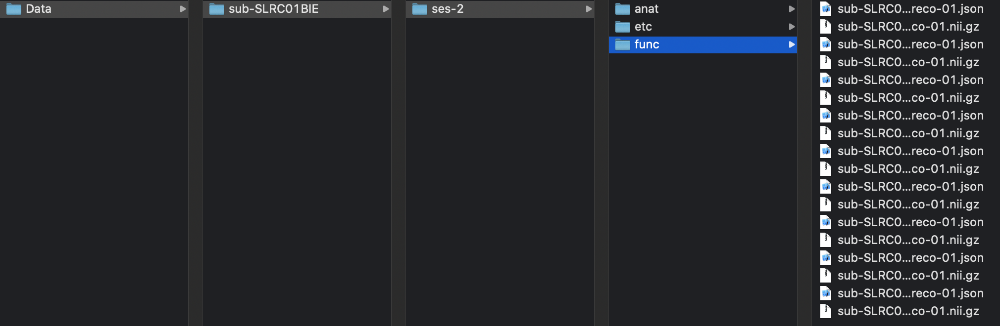
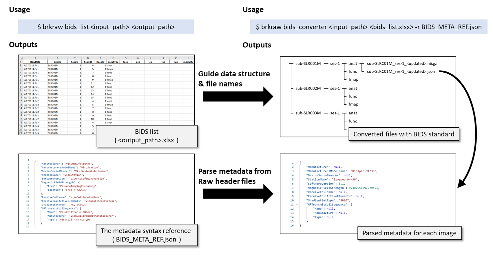
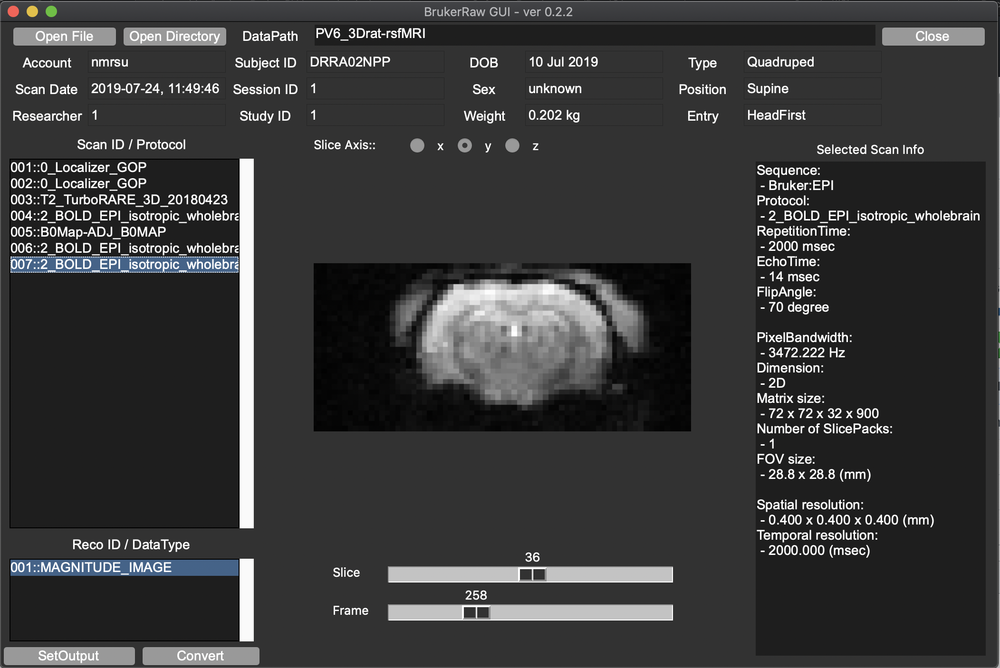
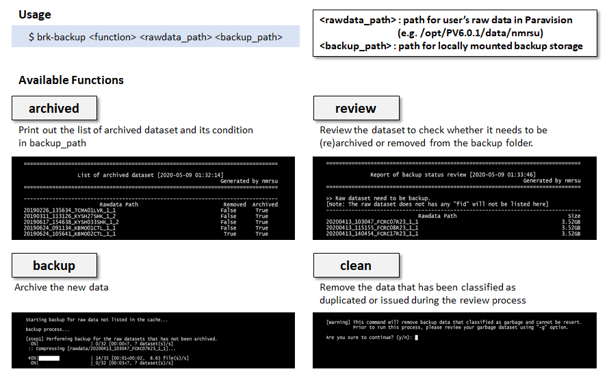

[](https://zenodo.org/badge/latestdoi/245546149)

# BrkRaw: Comprehensive tool to access Bruker PV dataset
## Version: 0.3

### Description

The 'BrkRaw' python module is designed to be a more comprehensive tool for the preclinical MRI community for accessing and 
utilizing raw data. And since the converter is front-line tools for medical imaging, the functionality is developed to cover 
the requirements from the various user, including MRI system operator, maintainer, MR sequence developer, imaging researcher, 
and data scientist. In addition to these, we had put extra efforts to preserve the metadata as well as provide tools to help 
organize the data structure into a shareable format that suggested from the open science community for pursuing 
reproducible science [BIDS](https://bids.neuroimaging.io). Therefore, the module designed not only can be used for the NifTi converter, 
but also provides command-line tools and python API for previewing, organizing and archiving data, and parsing metadata, 
accessing the data as users convenient object type ([nibabel](https://nipy.org/nibabel/) or 
[SimpleITK](https://simpleitk.readthedocs.io/en/master/gettingStarted.html#python-binary-files)) 
without the conversion step. The module is compatible with the ZIP file format, so no need to uncompress the file to access data.
The goal of this project is providing easy-to-access of the Bruker's PVdatasets. 
The major features of this module are as follows.

- Reliable converting function with
    - preserving the subject position and orientation to converted the NifTi1 file.
    - correction of animal orientation based on the species and position. (Anterior of subject is Anterior)
    - providing fMRI and DTI study friendly features: slice-order update on the header, Diffusion parameter file generation.
    - BIDS(v1.2.2) support: parameter file generation with custom syntax, automatic generation of the folder structure.
- Capability of quick image validation by
    - providing the GUI tool for preview the dataset without conversion.
    - the command-line tool function for previewing metadata of the dataset for each scan.
- Data management tool 'brk-backup'
    - Data management tool 'brk-backup' for archiving and performing inspection the backup status.
- Robust and easy-to-use python API for developers, including JCAMP-DX parser.
    - Object-oriented robust dataset parser.
    - compressed data readability (compatible with .zip and .PVdatasets format).
    - the python API also providing data handler object through either nibabel and simpleITK to make convenient to the researcher can implement their own code.  



**Fig1.** Example subject alignment shown on FSLeyes, the overlayed localizer image for each slice axis(gray) and a EPI image(red) are align in the same space while the preserve subject orientation (correct R-L, I-S, A-P on rodent)

### Compatibility
- Cross-platform compatibility (OSX, Linux, Windows 10)
- Best work on Python 3.7.6, does not support Python 2.
- Dependency: shleeh>=0.0.4, nibabel>=3.0.2, SimpleITK>=1.2.4,
              numpy>=1.18.0, pandas>=1.0.0, pillow>=7.1.1, 
              tqdm>=4.45.0, openpyxl>=3.0.3, xlrd>=1.0.0

### Installation
- We are highly suggesting to use **Python 3.7**

#### Requirement
- The installed Python must be compiled properly, 
If you use pyenv and are having any issue with python please refer following link: 
[Common Build Problems in PyENV](https://github.com/pyenv/pyenv/wiki/common-build-problems)
- To use gui feature, the installed python should compiled with tkinter module.
- You can test the tkinter installation with below command on your shell.
```angular2html
$ python -m tkinter -c 'tkinter._test()'
```

- In Mac OSX, Homebrew installed tcl-tk and pyenv may have an issue with tkinter, please refer following link to solve the issue:
[Issue with Homebrew installed tcl-tk on pyenv](https://github.com/pyenv/pyenv/issues/1375)

#### Install via PyPI
```angular2html
$ pip install bruker
```

#### Install via Github
```angular2html
$ pip install git+https://github.com/dvm-shlee/bruker
```

#### Known issues
- The module have been tested for PV 5 to PV 6.0.1 datasets. but it may have issue with higher version.
- The GUI may not work if the python does not be built with tkinter, please check above instruction.
- If GUI popped up but not working after selecting the dir, make sure you entered to dataset dir.
- If GUI cannot load zipped file, please check our example file located at 'examples' folder.
- If you experience any other issue, please use 'issue' tab in Github to report.
- If the dataset contains MR Spectroscopy, some method not work properly 
(such as the function to printing out dataset summary)

## Usage
### Command-line tool (brkraw)
#### Quick access of metadata
- Printing out dataset information
```angular2html
$ brkraw summary <session path or compressed dataset>
```

**Example of printed out dataset information**

#### The Legacy version of NifTi1 conversion
- This method has been inherited from old brk2nii and [PyBruker](https://pypi.org/project/pyBruker) which 
has been removed from this repository so does not exist. But this is useful if you want to convert 
whole dataset without need to considering data structure, or only needs to convert specific scan and reco.
- Convert a whole session, (adding option '-b' or '--bids' will generate JSON file that contains MR parameters based-on BIDS standard)
```angular2html
$ brkraw tonii <session path or compressed dataset>
```

- Convert a scan, (default reco_id is 1)
```angular2html
$ brkraw tonii <session path or compressed dataset> -s <scan id> -r <reco id>
```

- Build BIDS dataset with multiple Bruker raw datasets.
- You need to copy all data into one parent folder, compressed zip file will also work (we recommend to use zip file)
- All dataset under parent folder will be converted into ./Data folder with BIDS structure, but filename will not follow
the BIDS standard. If you need to share your data, we recommend to use bids_converter function instead.


**Example of automatically generated BIDS dataset**

```angular2html
$ brkraw tonii_all <parent folder>
```

#### Automatic BIDS organizer with template files

**The usage of the command-line tool 'brkraw' for BIDS data organization.**

- Upgraded feature to reduce burden on renaming according to BIDS standard.
- Create BIDS file table with excel format to rename the file accordingly for BIDS standard.
- You can also crop the data automatically if you set the range on BIDS table excel file.
- This will return also the BIDS_META_REF.json which allows you to input the template of BIDS json parser syntax
- To learn more detail, please check our example 
[Jupyter Notebooks](https://github.com/dvm-shlee/bruker/blob/master/examples/BrkRaw_PythonAPI.ipynb).
```angular2html
$ brkraw bids_list <parent folder> <filname>.xlsx
```

- Build BIDS dataset according to the excel file generated with 'bids_list' command above.
```angular2html
$ brkraw bids_converter <parent folder> <BIDS table file.xlsx>

$ brkraw bids_converter <parent folder> <BIDS table file.xlsx> -r <BIDS meta reference file.json>
```

- Run GUI with input and output path
```angular2html
$ brkraw gui -i <session path> -o <output path>
```

**brkraw gui interface.**

- Run GUI without path. Without path, two buttons (load file / load dir) will shows up.
Make sure you select correct button based on the dataset type (zip file or dir). 
In case of dir, please enter into the folder contains 'subject' file using dialog instead of 
just highlighting it (common mistake). 
```angular2html
$ brkraw gui
```

### Data management tool

**brk-backup script utilizing the Python API to immediately access both raw data and archived data 
to parse the metadata for data management.**

- Print out archived dataset and its condition
```angular2html
$ brk-backup archived <rawdata path> <backup path>

$ brk-backup archived <rawdata path> <backup path> -l  // generate log file instead of printing
```

- Print out review backup status
```angular2html
$ brk-backup review <rawdata path> <backup path>

$ brk-backup review <rawdata path> <backup path> -l  // generate log file instead of printing
```

- Archive data from rawdata path to backup path, if the dataset has been archived and identical, then skip
```angular2html
$ brk-backup backup <rawdata path> <backup path>
```

- Remove files classified as unnecessary via review process among backed up data. The interactive UI will ask you
to confirm each step to prevent erase important data
```angular2html
$ brk-backup clean <rawdata path> <backup path>
```

#### Windows 10
- Same as above, but use brkraw.exe instead of brkraw command.
- If this command is not working, please check the version of your Anaconda and Python.

#### Python API
- import module
```angular2html
>>> import brkraw
```

- load dataset
```angular2html
>>> rawdata = brkraw.load(<PATH>)
```

- For more detail, Please check out our 
[Jupyter Notebooks](https://github.com/dvm-shlee/bruker/blob/master/examples/BrkRaw_PythonAPI.ipynb) 
in the example directory.

### Contributing
- Please contact shlee@unc.edu if you interest to contribute for following items.
1. integration of reconstruction tool with Python API (such as BART tool).
2. develop online analysis tools for fMRI or DTI study.
3. Documentation or develop tutorials for various use.
- Also if you experience any bug or have any suggestion to improve this tool, please let us know.

### Credits:
- SungHo Lee (shlee@unc.edu)
- Woomi Ban (banwoomi@unc.edu)
- Yen-Yu Ian Shih (shihy@unc.edu)

### How to Cite

BibTeX Export
```
@software{sungho_lee_2020_3818615,
  author       = {SungHo Lee and Woomi Ban and Yen-Yu Ian Shih},
  title        = {dvm-shlee/bruker: BrkRaw v0.3.0},
  month        = may,
  year         = 2020,
  publisher    = {Zenodo},
  version      = {0.3.0},
  doi          = {10.5281/zenodo.3818615},
  url          = {https://doi.org/10.5281/zenodo.3818615}
}
```

### Acknowledgements
We thank to the staff and colleagues in the Center for Animal MRI (CAMRI) 
at the University of North Carolina at Chapel Hill for the testing and providing helpful 
feedback. Especially thanks to Ms. Tzu-Wen Wang for the test the data management tools. 
This work was supported by NIH (Grant No: RF1MH117053, R01MH111429, and R01NS091236).

### License:
GNU General Public License v3.0
