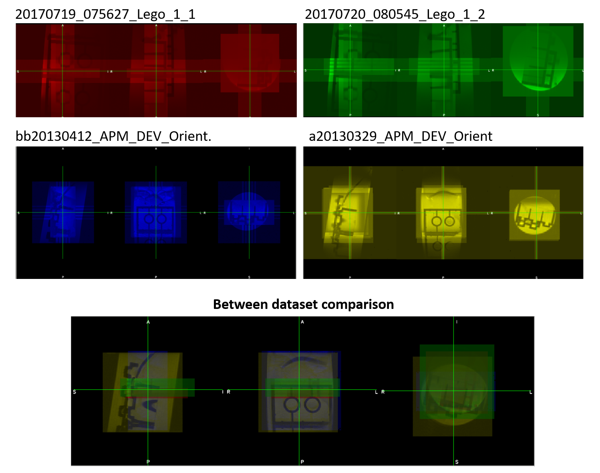

[](https://doi.org/10.5281/zenodo.3818614)

## BrkRaw: A comprehensive tool to access raw data of Bruker Biospin Preclinical MRI Systems
#### Version: 0.3.3

#### Description

The ‘BrkRaw’ is a python module designed to provide a comprehensive tool to access raw data acquired from 
Bruker Biospin preclinical MRI scanner. This module is also compatible with the zip compressed data 
to enable use of the archived data directly.  
The module is comprised of four components, including graphical user interface (GUI), command-line tools, 
high-level and low-level python APIs.
- For the GUI, we focused on improving convenience for checking metadata and previewing the reconstructed image.
- For the command-line tool, we focused on providing tools for converting, organizing, archiving, and managing data.
The command-line tool also provides easy-to-use function to convert large set of raw data into organized structure
according to [BIDS](https://bids.neuroimaging.io).
- For the high-level python API, we focused on enhancing the accessibility of reconstructed image data with 
preserved image orientation and metadata for the image analysis. 
It compatible users' convenient objects type ([nibabel](https://nipy.org/nibabel/) or 
[SimpleITK](https://simpleitk.readthedocs.io/en/master/gettingStarted.html#python-binary-files)) 
without the conversion step. 
- For the low-level python API, we focused on providing a consistent method to access raw Bruker data including 
parameter and binary files with the python compatible datatype while keeping the sake of simplicity.

##### Conversion reliability

We've tested our converter using the sample dataset from [Bruker2Nifti_QA](https://gitlab.com/naveau/bruker2nifti_qa) 
and the results showed correct geometry and orientation for all datasets.
We are still looking for more datasets showing orientation issue, 
**if you have any shareable dataset, please contact the developer.**


#### Website
For more detail information including installation, usage and examples, 
please visit our [GitPage](https://brkraw.github.io).

- [Installation](https://brkraw.github.io)
- [Command-line tool usage examples](https://brkraw.github.io)
- [Converting dataset into BIDS](https://brkraw.github.io)
- [Python API usage examples](https://brkraw.github.io)
- [GUI](http://brkraw.github.io)
- [How to contribute BrkRaw](https://brkraw.github.io)

#### Credits:
##### Authors
- SungHo Lee (shlee@unc.edu): main developer
- Woomi Ban (banwoomi@unc.edu): sub-developer who tested and refined the module structure
- Yen-Yu Ian Shih (shihy@neurology.unc.edu): technical and academical advisory on this project (as well as funding)
##### Contributors
- Drs. Chris Rorden and Sebastiano Ferraris: The pioneers related this project who had been inspired the developer
 through their great tools including [dcm2niix](https://github.com/rordenlab/dcm2niix) and 
 [bruker2nifti](https://github.com/SebastianoF/bruker2nifti), as well as their comments to improve this project. 
- Drs. Mikael Naveau and Gabriel A. Devenyi: The publisher of 
[bruker2nifti_qa](https://gitlab.com/naveau/bruker2nifti_qa), the set of data 
to help benchmark testing of Bruker converter.

#### License:
GNU General Public License v3.0

#### Citing BrkRaw
SungHo Lee. (2020, May 13). dvm-shlee/bruker: BrkRaw v0.3.2 (Version 0.3.2). Zenodo. http://doi.org/10.5281/zenodo.3818614

**BibTeX**
```
@software{sungho_lee_2020_3818614,
  author       = {SungHo Lee and Woomi Ban and Yen-Yu Ian Shih},
  title        = {dvm-shlee/bruker: BrkRaw v0.3.2},
  month        = may,
  year         = 2020,
  publisher    = {Zenodo},
  version      = {0.3.2},
  doi          = {10.5281/zenodo.3818614},
  url          = {https://doi.org/10.5281/zenodo.3818614}
}
```
