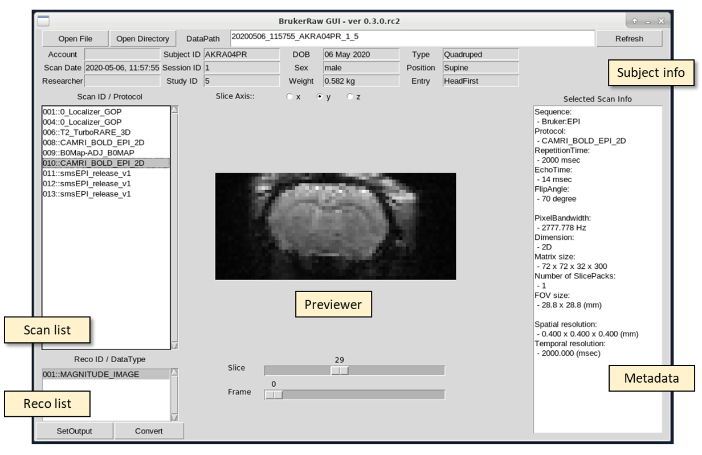

# BrkRaw: Comprehensive tool to handle Bruker PV dataset
## Version: 0.2.3

### Description

While the Bruker MRI scanner has been widely used for preclinical MR imaging research, 
the direct accessibility of Bruker's raw dataset is poor compared to the clinical MRI scanner due to the limited resource to handle the format.
So far, several Bruker raw data converter had been introduced, still, a few issues remain.
1. The converted data does not preserve the original subject orientation, as well as the subject type-specific position.
2. Lack of a robust tool to handle and preview of raw dataset.

To overcome these issues, **BrkRaw** module is designed to provide comprehensive access to the Bruker's PVdataset via below features
- preserving the subject position and orientation to converted the NifTi1 file.
- correction of animal orientation based on their species.
- providing the GUI tool for preview the dataset and NifTi1 format conversion.
- the command-line tool for converting to NifTi1 format, previewing metadata of the dataset, checking backup status.
- providing fMRI and DTI study friendly features: slice-order update on the header, Diffusion parameter file generation.
- BIDS(v1.2.2) support: parameter file generation, automatic generation of the folder structure.
- Object-oriented robust dataset parser.
- compressed data readability (compatible with .zip and .PVdatasets format).
- providing robust and easy-to-use python API for developers, including JCAMP-DX parser.


**Fig1.** Example subject alignment shown on FSLeyes, the overlayed localizer image for each slice axis and a EPI image are align in the same space while the preserve subject orientation (correct R-L, I-S, A-P on rodent)

### Compatibility
- Cross-platform compatibility (OSX, Linux, and Windows 10 with Anaconda3)
- Best work on Python 3.7.6, does not have backward compatibility with Python 2.
- Dependency: numpy, pillow, nibabel, tqdm

### Installation
- Suggesting using the pyenv and Python 3.7.6 on Linux and mac,
- Suggesting using local installed Anaconda3 (at UserHome) with Python 3.7.6 (ver. 2020.02)

```angular2html
pip install bruker
```

### Usage
#### Linux/Unix
- Printing out dataset information
```angular2html
brkraw summary <session path or compressed dataset>
```

**Fig2.** Example of printed out dataset information

- Convert a whole session, (adding option '-b' or '--bids' will generate JSON file that contains MR parameters based-on BIDS standard)
```angular2html
brkraw tonii <session path or compressed dataset>
```

- Convert a scan, (default reco_id is 1)
```angular2html
brkraw tonii <session path or compressed dataset> -s <scan id> -r <reco id>
```

- Build BIDS dataset with multiple Bruker raw datasets. 
- All dataset under parent folder will be converted into ./Data folder with BIDS
```angular2html
brkraw tonii_all <parent folder>
```

**Fig3.** Example of automatically generated BIDS dataset

- Run GUI with input and output path
```angular2html
brkraw gui -i <session path> -o <output path>
```

**Fig4.** brkraw gui interface.

- Run GUI without path
```angular2html
brkraw gui
```

- Check backup status and generate log file at backup path
```angular2html
brkraw chk_bckstatus <rawdata path> <backup path> -l
```

#### Windows 10
- Same as above, but use brkraw-win.bat instead of brkraw command.
- If this command is not working, please check the version of your Anaconda and Python.
- Your anaconda package must be installed at C:\Users\<UserHome>\Anaconda3, if not, please update the 'brkraw-win.bat' to target correct path for python and brkraw script.

```angular2html
C:\> brkraw-win gui
```

#### Python API
- import module
```angular2html
import brkraw
```

- load dataset
```angular2html
rawdata = brkraw.load(<PATH>)
```

- For more detail, Please check Jupyter Notebooks in the example directory.

### Contributing
- Please contact shlee@unc.edu if you interest to contribute for following items.
1. improve compatibility with other python versions.
2. integration of reconstruction tool with Python API (such as BART tool).
3. develop online analysis tools for fMRI study.
4. Documentation
- Also if you experience any bug or have any suggestion to improve this tool, please let us know.

### Credits:
- SungHo Lee (shlee@unc.edu)
- Woomi Ban (banwoomi@unc.edu) 

### License:
GNU General Public License v3.0
