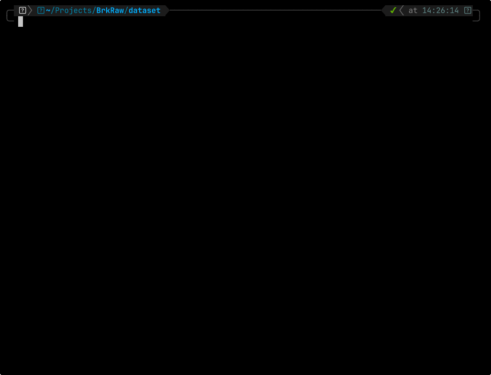

# **BrkRaw**

A modular toolkit for converting Bruker Paravision MRI data into structured, reproducible, explicit file-format outputs.

## **Inspect and convert ParaVision raw data, directly and flexibly**

Inspect studies, explore parameters, and convert data step by step with a flexible, parameter-based,
spec- and rule-driven workflow.

## **How BrkRaw works?**

- Inspect-first workflow: metadata can be inspected directly from the CLI before conversion.
- Parameter-based parsing: rules and specs define metadata extraction and sidecar generation.
- Extensible conversion: the same rule-based framework drives conversion and reconstruction via hooks.

## New here? Start with  👉 [Getting Started](getting-started/index.md)
