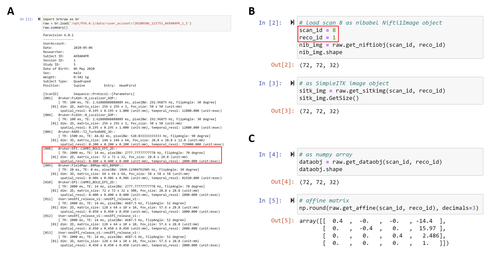

# Summary
To access the raw Magnetic Resonance Imaging (MRI) data for the research, 
it required data conversion from the vendor-specific to software compatible format.
Usually, this step takes an additional layer to convert the data into DICOM, 
the standard imaging format in Medicine, that has been designed to cover 
a huge variety of Metadata including patient information that not really necessary in the preclinical research field. 
Due do the complex data structure of DICOM, it is not intuitive to use directly in analysis software.
Accordingly, an image format with an intuitive structure based on spatial and temporal information of images 
such as NifTi, Analyze, and NRRD formats has been proposed, and is widely used in the field of medical imaging.
This has been adding up an additional layer to the analysis workflow that reduces the efficiency of 
the overall process at the first step.

For the above reason, researchers had developed the Bruker raw 
to the NifTi or Analyze converter[@Brett:2002; @Ferraris:2017; @Rorden:2018; @Chavarrias:2017] 
for bypassing the intermediate DICOM conversion step.
However, still, it focused on only data conversion as a conventional way that converting the file 
into the target format of the file and has not been providing features 
to improve the overall efficiency of data processing in terms of enhancing data accessibility.

The 'BrkRaw' python module is designed to be a more comprehensive tool for the preclinical 
MRI community for accessing and utilizing raw data. And since the converter is
front-line tools for medical imaging, we added extra features to cover the requirements from the various user 
including MRI system operator, maintainer, MR sequence developer, imaging researcher, and data scientist.
In addition to these, we had put extra efforts to preserve the metadata as well as provide tools 
to help organize the data structure into a shareable format that suggested from the open science community 
for pursuing reproducible science [@Gorgolewski:2016].
Therefore, the module designed not only can be used for the NifTi converter, but also provides command-line tools 
and python API for previewing, organizing and archiving data, and parsing metadata, 
accessing the data as users convenient object type (nibabel[@Brett:2020] or SimpleITK[@Lowekamp:2013]) 
without the conversion step. The module is compatible with the ZIP file format, 
so no need to uncompress the file to access data.

The module has been actively utilizing as a front-line tool in the Center for Animal MRI (CAMRI) 
and Biomedical Imaging Research Center (BRIC) at The University of North Carolina at Chapel Hill 
for several on-going preclinical functional MRI studies, sequence development, and data management. 
We expect this tool can benefit other animal imaging research sites and researchers to reduce 
their burden on handling and management of Bruker raw datasets and further data organization 
to pursue reproducible science. The future will be developing python-based acute quality control 
and realtime fMRI data analysis tools.

# Figures

**Figure 1.** The example usage of python API.
The module provides print function to check the data, and the data can be loaded directly with convenient datatype.
Please check example folder in the module for additional features.

**Figure 2.** The example usage of the command-line tool 'brkraw' for BIDS data organization. 
The ready-to-share BIDS dataset can be generated easily by filling out the template files 
generated by the single command (left) followed by running the conversion (right).

**Figure 3.** The example usage of the command-line tool 'brk-backup' for data management.

**Figure 4.** The example usage of graphical user interface (GUI) for preview data.
The GUI is useful when the quick preview of the image is required. It prints out subject info and scan parameters, 
and the slice axis also can be changed to look at the image with different view planes in case of a multi-slice image.

# Acknowledgements

Fund?

# References