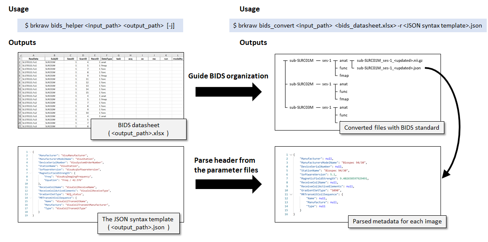

# Summary
The Magnetic Resonance Imaging (MRI) data are acquired in a vendor-specific format which requiring 
the conversion for the subsequent data analysis. The Digital Imaging and Communications in Medicine (DICOM) has been 
used as an international standard for handling MRI data due to its medical application. On the other hand, 
in the research field, the data formats with a simple structure that only composed of metadata that contains 
information only for reconstructing binary data, such as NifTi-1, ANALYZE, or NRRD formats, have been adopted as 
the new standard of choice because of their simplicity and efficiency. 

Converting the raw data into DICOM format is still important to preserve the patient-related information coupled 
with the images in the clinical field, however, in the preclinical setting, the data format does not need to be 
internally complex so that the canonical way to initially convert data into DICOM and subsequent conversion makes 
the overall analysis pipeline inefficient.

Due to this reason, several researchers had developed tools to directly convert raw data to a NifTI or ANALYZE format, 
particularly for the preclinical MRI. [@Brett:2002; @Ferraris:2017; @Chavarrias:2017; @Rorden:2018]. These converters 
significantly improved the efficiency of data analysis workflow for most applications. Still, it can be insufficient 
for some circumstances when researchers develop a new imaging sequence that requiring new set parameters or 
an additional layer of preprocessing for image reconstruction or when a quick quality assessment of raw data that 
the providers' software does not support.

Here we present the 'BrkRaw' Python module, a more comprehensive tool to access and handle raw data for the preclinical 
MRI scanner. Because the Bruker Biospin MRI scanner is the only ultra-high field preclinical MRI scanner currently 
available in the market, we focussed on this specific vendor instead of developing a universal converter. 
The BrkRaw module provides Application Programming Interface (API) and command-line tools to help integrate 
into the data analysis pipeline more flexibly.

The API provides flexibility to parse any metadata using a custom-designed robust JCAMP-DX loader (the data format of
storing metadata in Bruker scanner.) as well as the more high-level data loader that converts it to nibabel[@Brett:2020] 
or SimpleITK[@Lowekamp:2013] object, the two most popular python-based image object, instead of saving it into the file, 
so the data can be processed at the memory level.

The command-line tools provide convenient function to convert, archive, and organize the data. 
First, the 'brk-backup' command is designed to zip compress raw data and archive to target folder with semi-automated 
inspection function to check missing, updates, broken, or duplicated data (Figure2). 
The 'brkraw' command, on the other hand, offers a useful function to check data information (Figure3) and 
to convert data into NifTi-1 format as conventional converter. 
In addition to this, the command provides automate conversion and organization of large datasets into a ready-to-share 
data structure, the Brain Imaging Data Structure (BIDS), a standard data structure for neuroimaging research proposed 
by the open science community for pursuing reproducible science [@Gorgolewski:2016] (Figure4).
Lastly, with the 'brkraw gui' command, the module offers the function to preview images and their respective parameters
without conversion (Figure5) as a show case of utilizing API for quick data assessment. 

Overall, the BrkRaw demonstrates its flexibility in handling data with the python API as well as the advanced functions 
that conventional converter did not provide. This module has been actively utilized for multiple projects in 
the Center for Animal MRI (CAMRI) at the University of North Carolina at Chapel Hill. We expect this tool provides a 
unique advantage to the researchers who utilizing the Bruker preclinical MRI scanner for their research as well as 
medical imaging scientists who interested in accessing preclinical MRI data more flexible manner.

# Figures

**Figure 1. The overlapped converted images that shows successful conversion of Bruker2Nifti_QA dataset**

**Figure 2. The main function of brk-backup command for data management**

**Figure 3. The example of brkraw command usage to print out data information**

**Figure 4. The example usage of the command-line tool 'brkraw' for BIDS data organization.**

**Figure 5. The graphical user interface (GUI) for previewing image and parameters**

# Acknowledgements

We would like to thank the researchers of the Rorden lab at the University of South Carolina, especially
Drs. Chris Rorden and Sebastiano Ferraris, in regards to their pioneer works that inspired this project
and their support on sharing their expertise on this topic. We would also like to thank Dr. Mikael Naveau at Cyceron and
Gabriel A. Devenyi at Douglas Mental Health University Institute who shared the dataset for the benchmarking converter.
Lastly, We thank the Center for Animal MRI (CAMRI) at the University of North Carolina at Chapel Hill
for the testing and providing helpful feedback. We especially thanks to Mrs. Tzu-Wen Wang for testing the data management tools
and Ms. Alicia M. Stevans for revising the manuscript. This work was supported by NIH
(Grant No: RF1MH117053, R01MH111429, and R01NS091236).

# References
